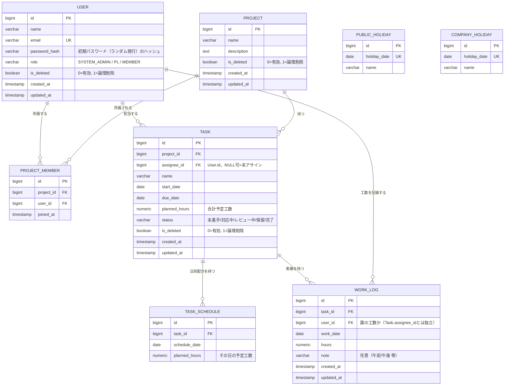

# 1. 本ドキュメントの位置づけ

`01_企画・要件定義.md` で「設計フェーズで決定する」とされていた項目を確定し、テーブル定義とER図としてまとめる。

要件定義側との対応関係：

| 要件定義の記述 | 本ドキュメントでの決定内容 |
|---|---|
| 5. プロジェクトとユーザー（多対多） | `ProjectMember` で中間テーブル化 |
| 6.2 タスク管理「担当者の詳細な関係」 | 1タスク1担当者（`Task.assignee_id`、未アサイン可＝NULL許容） |
| 8. 工数管理（Task/TaskSchedule/WorkLog） | 3テーブルに分離。WorkLogは1タスク×1日で複数件可、入力者記録なし |
| 10. 営業日管理（BusinessCalendar） | `PublicHoliday`（祝日）／`CompanyHoliday`（会社独自休日）の2テーブルに変更。土日判定はアプリロジック |
| （未記載）認証方式 | ユーザー登録時にランダムな初期パスワードを発行し共有する運用（MVP）。パスワード変更機能は次期開発 |
| （未記載）email一意制約と論理削除の競合 | UNIQUE制約はそのまま。復帰時は新規登録ではなく「社員復活」機能で対応 |
| （未記載）未アサインタスクの負荷計上 | 誰の負荷にも計上しない。代わりにプロジェクト一覧/詳細画面で警告アラート表示 |

※ `BusinessCalendar` という単一テーブル案は撤回し、2テーブル構成に変更。`01_企画・要件定義.md` の該当箇所（9章・10章・12章）も更新済み。

---

# 2. ER図

---

# 3. テーブル定義

## 3.1 User（社員）

| カラム | 型 | 制約 | 説明 |
|---|---|---|---|
| id | bigint | PK | |
| name | varchar(100) | NOT NULL | 氏名 |
| email | varchar(255) | NOT NULL, UNIQUE | ログインID兼用 |
| password_hash | varchar(255) | NOT NULL | ユーザー登録時にランダム発行した初期パスワードをハッシュ化して保存。パスワード変更機能はMVP対象外（次期開発） |
| role | varchar(20) | NOT NULL | `SYSTEM_ADMIN` / `PL` / `MEMBER` |
| is_deleted | boolean | NOT NULL, DEFAULT false | 論理削除フラグ（true=削除済み） |
| created_at / updated_at | timestamp | NOT NULL | |

- 論理削除しても、過去のTask/WorkLog等の履歴データは参照可能（FKで消えない）。
- システム管理者を最低2名維持するルールは、DB制約ではなくアプリケーション側（権限変更・削除時のバリデーション）で担保する。
- `email`にはUNIQUE制約をそのまま付与する（部分インデックス等の特殊対応は行わない）。
- 論理削除済みの社員と同じメールアドレスの人物が復帰する場合、新規登録ではなく「社員復活」機能（社員一覧画面等から論理削除済みユーザーを検索し、`is_deleted`を`false`に戻す）で対応する運用とする。これにより同一emailでの新規INSERTは発生せず、UNIQUE制約との競合は起きない。

## 3.2 Project

| カラム | 型 | 制約 | 説明 |
|---|---|---|---|
| id | bigint | PK | |
| name | varchar(200) | NOT NULL | |
| description | text | NULL可 | |
| is_deleted | boolean | NOT NULL, DEFAULT false | 論理削除フラグ |
| created_at / updated_at | timestamp | NOT NULL | |

## 3.3 ProjectMember（User-Projectの中間テーブル）

| カラム | 型 | 制約 | 説明 |
|---|---|---|---|
| id | bigint | PK | |
| project_id | bigint | FK → Project.id, NOT NULL | |
| user_id | bigint | FK → User.id, NOT NULL | |
| joined_at | timestamp | NOT NULL | 所属開始日時 |

- `(project_id, user_id)` に UNIQUE制約。
- PLかどうかはUser.roleで判定するため、ここに役割カラムは持たせない（PLは特定プロジェクトの役職ではなく、ユーザーの全体権限のため）。

## 3.4 Task

| カラム | 型 | 制約 | 説明 |
|---|---|---|---|
| id | bigint | PK | |
| project_id | bigint | FK → Project.id, NOT NULL | |
| assignee_id | bigint | FK → User.id, NULL可 | 未アサイン状態を許容 |
| name | varchar(200) | NOT NULL | |
| start_date | date | NOT NULL | |
| due_date | date | NOT NULL | |
| planned_hours | numeric(6,2) | NOT NULL | 合計予定工数 |
| status | varchar(20) | NOT NULL | 未着手/対応中/レビュー中/保留/完了 |
| is_deleted | boolean | NOT NULL, DEFAULT false | 論理削除フラグ |
| created_at / updated_at | timestamp | NOT NULL | |

- `assignee_id`がNULLの間、そのタスクの工数は誰の負荷としても計上されない（カレンダー上の個人別集計には出てこない）。
- 未アサインタスクの存在自体を管理者・PLが見落とさないよう、プロジェクト一覧画面またはプロジェクト詳細画面に「未アサインタスクあり」の警告アラートを表示する（要件定義側のUI機能として対応、DB構造への影響なし）。

## 3.5 TaskSchedule（予定工数の日別配分）

| カラム | 型 | 制約 | 説明 |
|---|---|---|---|
| id | bigint | PK | |
| task_id | bigint | FK → Task.id, NOT NULL | |
| schedule_date | date | NOT NULL | |
| planned_hours | numeric(5,2) | NOT NULL | その日の配分工数 |

- `(task_id, schedule_date)` に UNIQUE制約。
- タスク作成時、`start_date`〜`due_date`の営業日に`planned_hours`を均等配分して自動生成。
- タスク編集（開始日/納期/予定工数の変更）時は、既存のTaskScheduleを削除して再生成する方針（MVPではドラッグ&ドロップ調整非対応のため、手動調整分を気にする必要がない）。

## 3.6 WorkLog（実績工数）

| カラム | 型 | 制約 | 説明 |
|---|---|---|---|
| id | bigint | PK | |
| task_id | bigint | FK → Task.id, NOT NULL | |
| user_id | bigint | FK → User.id, NOT NULL | 誰の工数かを表す。`Task.assignee_id`（現在の担当者）とは独立して保持し、担当者変更や未アサイン期間があっても履歴が壊れないようにする |
| work_date | date | NOT NULL | |
| hours | numeric(4,2) | NOT NULL | |
| note | varchar(200) | NULL可 | 例：「午前」「午後」等、任意入力 |
| created_at / updated_at | timestamp | NOT NULL | |

- 1タスク×1日に複数件登録可（ユニーク制約なし）。
- タスク単位・日単位の実績工数は `SUM(hours) GROUP BY task_id, work_date` 等で集計。
- `WorkLog`は`task_id`と`user_id`の両方を持つことで、User⇔TaskのN:N関係を表す中間テーブル（連関エンティティ）としての役割を兼ねる。`date`・`hours`はこのN:N関係に付随する属性という位置づけ。
- インデックス方針：
  - `(task_id, work_date)`：タスク単位の実績集計用
  - `(user_id, work_date)`：ユーザー単位・日別の負荷集計用（カレンダー機能で多用するため重要）

## 3.7 PublicHoliday（祝日）

| カラム | 型 | 制約 | 説明 |
|---|---|---|---|
| id | bigint | PK | |
| holiday_date | date | NOT NULL, UNIQUE | |
| name | varchar(100) | NOT NULL | 例：「元日」「成人の日」 |

## 3.8 CompanyHoliday（会社独自休日）

| カラム | 型 | 制約 | 説明 |
|---|---|---|---|
| id | bigint | PK | |
| holiday_date | date | NOT NULL, UNIQUE | |
| name | varchar(100) | NOT NULL | 例：「夏季休暇」「創立記念日」 |

- どちらもシステム管理者が数年分をあらかじめ個別登録する運用。
- 営業日判定ロジック（アプリ側）：`平日（月〜金） かつ PublicHolidayに存在しない かつ CompanyHolidayに存在しない`。

---

# 4. マスキング方針

非所属プロジェクトの情報マスキングは、専用テーブルを設けず、API/クエリ層で実装する。
具体的には「アクセスしてきたUserがそのProjectのProjectMemberに存在しない場合、プロジェクト名・タスク名等の詳細フィールドをマスクした状態でレスポンスを返す」というアプリケーションロジックで対応する。

---

# 5. 認証方式（MVP）

- ユーザー登録（社員登録）時に、システムがランダムな初期パスワードを生成し、`password_hash`にハッシュ化して保存する。
- 生成した初期パスワードは、登録者（システム管理者）が本人に別途（口頭・社内チャット等）共有する運用とする（システムからのメール送信等は行わない）。
- ログイン後のパスワード変更機能は、MVPの対象外とし、次期開発案件とする。
