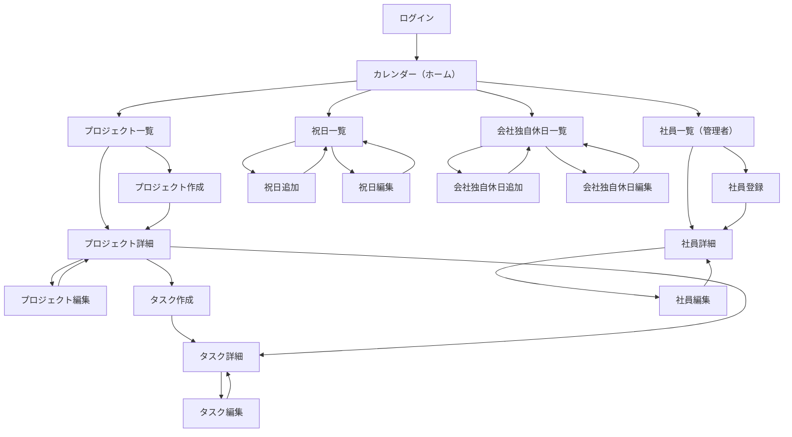

# 1. 本ドキュメントの位置づけ

`01_企画・要件定義.md`（機能要件）・`03_API設計.md`（API）を踏まえて、画面一覧・画面遷移・各画面の表示項目/操作/使用APIを定義する。

- 作成・編集は**専用ページ遷移**とする（モーダルは使わない）。
- 全体のナビゲーションは**左サイドバー**固定とする。
- ログイン後のトップ画面は**カレンダー画面**とする（本システムの中核機能のため）。

---

# 2. 画面一覧

| 画面名 | パス | 権限 | 概要 |
|---|---|---|---|
| ログイン | `/login` | 未ログイン | メール・パスワードでログイン |
| カレンダー（ホーム） | `/` | 認証済み全員 | プロジェクト横断の負荷を週単位で可視化 |
| プロジェクト一覧 | `/projects` | 認証済み全員 | プロジェクト一覧（マスキング適用） |
| プロジェクト詳細 | `/projects/:projectId` | 認証済み全員 | メンバー一覧・タスク一覧（マスキング適用） |
| プロジェクト作成 | `/projects/new` | SYSTEM_ADMIN, PL | 新規プロジェクト作成 |
| プロジェクト編集 | `/projects/:projectId/edit` | SYSTEM_ADMIN, PL | プロジェクト情報編集 |
| タスク詳細 | `/projects/:projectId/tasks/:taskId` | 認証済み全員 | タスク詳細・実績工数の入力/一覧 |
| タスク作成 | `/projects/:projectId/tasks/new` | SYSTEM_ADMIN, PL | 新規タスク作成 |
| タスク編集 | `/projects/:projectId/tasks/:taskId/edit` | SYSTEM_ADMIN, PL | タスク情報編集 |
| 社員一覧 | `/users` | SYSTEM_ADMIN | 社員一覧・検索 |
| 社員詳細 | `/users/:userId` | SYSTEM_ADMIN | 社員詳細・権限変更・論理削除/復活 |
| 社員登録 | `/users/new` | SYSTEM_ADMIN | 新規社員登録（初期パスワード発行） |
| 社員編集 | `/users/:userId/edit` | SYSTEM_ADMIN | 社員情報編集 |
| 祝日一覧 | `/holidays/public` | SYSTEM_ADMIN | 祝日の一覧・検索 |
| 祝日追加 | `/holidays/public/new` | SYSTEM_ADMIN | 祝日の新規登録 |
| 祝日編集 | `/holidays/public/:holidayId/edit` | SYSTEM_ADMIN | 祝日の編集 |
| 会社独自休日一覧 | `/holidays/company` | SYSTEM_ADMIN | 会社独自休日の一覧・検索 |
| 会社独自休日追加 | `/holidays/company/new` | SYSTEM_ADMIN | 会社独自休日の新規登録 |
| 会社独自休日編集 | `/holidays/company/:holidayId/edit` | SYSTEM_ADMIN | 会社独自休日の編集 |

---

# 3. 画面遷移図



---

# 4. 共通レイアウト

```text
+--------------------------------------------------+
| ヘッダー：システム名 / ログイン中ユーザー名 / ログアウト |
+---------------+------------------------------------+
| サイドバー     | メインコンテンツ                     |
|  ・カレンダー   |                                      |
|  ・プロジェクト |                                      |
|  ・社員管理*    |                                      |
|  ・祝日管理*    |                                      |
|  ・会社独自休日管理* |                                 |
+---------------+------------------------------------+
```

- `*`：`SYSTEM_ADMIN`のみサイドバーに表示（`PL`・一般ユーザーには非表示）。
- ヘッダーの「ログアウト」は`POST /api/auth/logout`を呼び、成功後`/login`へ遷移。
- 未認証状態で保護ページに直接アクセスした場合は`/login`にリダイレクトする（`GET /api/auth/me`が401を返した場合の共通ハンドリング）。
- 本システムはPCでの利用を前提とし、タブレット・スマートフォン向けのレスポンシブ対応は行わない（想定最小画面幅：1280px程度）。

---

# 5. 各画面の詳細

## 5.1 ログイン画面（`/login`）

**表示項目**
- メールアドレス入力欄
- パスワード入力欄
- ログインボタン
- エラーメッセージ表示欄（認証失敗時）

**使用API**：`POST /api/auth/login`

**操作**：ログイン成功→`/`（カレンダー）へ遷移。失敗→エラーメッセージ表示（画面遷移なし）。

---

## 5.2 カレンダー画面（`/`）

本システムの中核機能。プロジェクト横断でメンバーの負荷を可視化する。

**表示単位**：「週」「月」の2種をMVPに含める（タブ等で切り替え）。「日」表示は次期対応とする（`01_企画・要件定義.md` 11章「MVP対象外」に記載）。

**レイアウト（共通）**：行＝メンバー、列＝日付のマトリクス表示。週表示・月表示のどちらも同じ`GET /api/calendar/load?from=&to=`を、指定する`from`/`to`の範囲だけ変えて呼び出す（APIの追加は不要）。

### 週表示

```text
              10/1(木)  10/2(金)  10/3(土)  10/4(日)  10/5(月)  10/6(火)  10/7(水)
山田太郎        予定8h     予定8h      -         -       予定4h    予定4h    予定4h
              実績7h     実績8h                        実績-      実績-      実績-
鈴木花子        予定4h     予定4h      -         -       予定8h    予定8h    予定8h
              実績4h     実績3h                        実績-      実績-      実績-
```

- 各セルには「予定工数」「実績工数」を併記する。
- 週の前後移動（前週／次週ボタン）。
- セルクリックで、その日にその人が担当しているタスクの内訳（プロジェクト別の予定/実績）をポップオーバー等で表示する（`GET /api/calendar/load`の`projects`配列を利用）。

### 月表示

- 列数が最大31列になるため、セルは「予定合計h／実績合計h」の数値のみ表示し、プロジェクト別の内訳は表示しない（画面が煩雑になるため）。
- セルクリックで、その日の内訳（プロジェクト別の予定/実績）をポップオーバー表示する（週表示と同じ挙動）。
- 月の前後移動（前月／次月ボタン）。

### 共通の注記

- 非所属プロジェクトの工数はマスキングされた状態（`projectName: "****"`）でも数値は表示する。
- 表示対象メンバーの絞り込み（特定ユーザーのみ表示）。

**使用API**：`GET /api/calendar/load?from=&to=`

---

## 5.3 プロジェクト一覧画面（`/projects`）

**表示項目**（一覧の各行）
- プロジェクト名（非所属はマスキングされた`"****"`がそのまま表示される）
- 未アサインタスクがある場合の警告アイコン（`hasUnassignedTasks`）
- 作成日

**操作**
- キーワード検索・ページング
- 行クリックでプロジェクト詳細へ遷移
- 「新規作成」ボタン（`SYSTEM_ADMIN`, `PL`のみ表示）→プロジェクト作成画面へ

**使用API**：`GET /api/projects?page=&size=&keyword=`

---

## 5.4 プロジェクト詳細画面（`/projects/:projectId`）

**表示項目**
- プロジェクト基本情報（名称・説明。非所属の場合は`"****"`表示）
- 未アサインタスクがある場合の警告バナー
- メンバー一覧（所属者のみ、または`SYSTEM_ADMIN`）
- タスク一覧（ステータス・担当者・予定工数などをテーブル表示。マスキング適用）

**操作**
- 「編集」「削除」ボタン（`SYSTEM_ADMIN`, `PL`のみ表示）
- 「メンバー追加」（`SYSTEM_ADMIN`, `PL`のみ表示）
- 「タスク追加」（`SYSTEM_ADMIN`, `PL`のみ表示）
- タスク一覧は「ステータス」「担当者」で絞り込み可能（プルダウン）
- タスク行クリックでタスク詳細へ遷移

**使用API**：`GET /api/projects/:id`、`GET /api/projects/:id/members`、`GET /api/projects/:id/tasks?status=&assigneeId=`

- 非所属者がアクセスした場合、プロジェクト基本情報・タスク一覧はマスキング表示、メンバー一覧は`403`のため非表示（要件定義7章の方針どおり）。

---

## 5.5 プロジェクト作成／編集画面（`/projects/new`, `/projects/:projectId/edit`）

**入力項目**
- プロジェクト名（必須）
- 説明（任意）

**使用API**：`POST /api/projects` / `PUT /api/projects/:id`

**操作**：保存成功→プロジェクト詳細画面へ遷移。バリデーションエラー→エラーメッセージ表示。

---

## 5.6 タスク詳細画面（`/projects/:projectId/tasks/:taskId`）

**表示項目**
- タスク基本情報（名称・担当者・開始日・納期・予定工数・ステータス）
- 日別の予定工数配分（TaskSchedule、参考情報として表示）
- 実績工数（WorkLog）一覧：日付・記録者・時間・メモ

**操作**
- 「編集」「削除」ボタン（`SYSTEM_ADMIN`, `PL`のみ表示）
- 「実績を記録」フォーム（日付・時間・メモを入力して`POST /api/tasks/:taskId/work-logs`）
- 実績行ごとに「編集」「削除」（記録者本人・`PL`・`SYSTEM_ADMIN`のみ表示）

**使用API**：`GET /api/tasks/:id`、`GET /api/tasks/:taskId/work-logs`、`POST/PUT/DELETE /api/tasks/:taskId/work-logs` 等

---

## 5.7 タスク作成／編集画面（`/projects/:projectId/tasks/new`, `/projects/:projectId/tasks/:taskId/edit`）

**入力項目**
- タスク名（必須）
- 担当者（社員一覧から選択、未選択＝未アサイン可）
- 開始日・納期（必須）
- 予定工数（必須）
- ステータス（編集時のみ）

**使用API**：`POST /api/projects/:projectId/tasks` / `PUT /api/tasks/:id`

**操作**：保存成功→タスク詳細画面へ遷移。開始日・納期・予定工数を変更した場合、TaskScheduleが自動再生成される旨を画面上に注記する。

---

## 5.8 社員一覧画面（`/users`、SYSTEM_ADMIN限定）

**表示項目**：氏名・メールアドレス・権限・在籍状況（論理削除済みかどうか）

**操作**
- キーワード検索・ページング
- 「新規登録」ボタン→社員登録画面へ
- 行クリックで社員詳細へ

**使用API**：`GET /api/users?page=&size=&keyword=`

---

## 5.9 社員詳細画面（`/users/:userId`、SYSTEM_ADMIN限定）

**表示項目**：氏名・メールアドレス・権限・在籍状況

**操作**
- 「編集」ボタン→社員編集画面へ
- 権限変更（プルダウンで`SYSTEM_ADMIN`/`PL`/`MEMBER`を選択）
- 「論理削除」ボタン（有効な社員の場合）／「復活」ボタン（論理削除済みの場合）

**使用API**：`GET /api/users/:id`、`PATCH /api/users/:id/role`、`DELETE /api/users/:id`、`POST /api/users/:id/restore`

---

## 5.10 社員登録／編集画面（`/users/new`, `/users/:userId/edit`）

**入力項目**
- 氏名（必須）
- メールアドレス（必須）
- 権限（新規登録時のみ選択、初期値`MEMBER`）

**使用API**：`POST /api/users` / `PUT /api/users/:id`

**操作**：新規登録成功時、生成された初期パスワード（`temporaryPassword`）を画面上に表示し、管理者がコピーして本人に共有できるようにする（このタイミング以外でパスワードは表示されない）。

---

## 5.11 祝日管理画面（SYSTEM_ADMIN限定）

`PublicHoliday`と`CompanyHoliday`は別テーブル・別リソースのため、画面・ルーティングも分離する（一覧ページを共有して inline 追加/削除するだけの構成にはしない）。プロジェクト/タスク/社員と同様、一覧・追加・編集の3画面構成で統一する。

### 5.11.1 祝日一覧（`/holidays/public`）

**表示項目**：日付・名称の一覧（期間指定で絞り込み）

**操作**：「追加」ボタン→祝日追加画面へ／行クリックで祝日編集画面へ／各行に「削除」ボタン

**使用API**：`GET /api/holidays/public?from=&to=`、`DELETE /api/holidays/public/:id`

### 5.11.2 祝日追加／編集（`/holidays/public/new`, `/holidays/public/:holidayId/edit`）

**入力項目**：日付（必須）・名称（必須）

**使用API**：`POST /api/holidays/public` / `GET /api/holidays/public/:id` / `PUT /api/holidays/public/:id`

**操作**：保存成功→祝日一覧画面へ遷移。

---

## 5.12 会社独自休日管理画面（SYSTEM_ADMIN限定）

祝日管理と同じ3画面構成（一覧・追加・編集）を`CompanyHoliday`向けに用意する。

### 5.12.1 会社独自休日一覧（`/holidays/company`）

**表示項目**：日付・名称の一覧（期間指定で絞り込み）

**操作**：「追加」ボタン→会社独自休日追加画面へ／行クリックで会社独自休日編集画面へ／各行に「削除」ボタン

**使用API**：`GET /api/holidays/company?from=&to=`、`DELETE /api/holidays/company/:id`

### 5.12.2 会社独自休日追加／編集（`/holidays/company/new`, `/holidays/company/:holidayId/edit`）

**入力項目**：日付（必須）・名称（必須）

**使用API**：`POST /api/holidays/company` / `GET /api/holidays/company/:id` / `PUT /api/holidays/company/:id`

**操作**：保存成功→会社独自休日一覧画面へ遷移。

---

# 6. 確定事項（本ラウンドで決定）

- カレンダー画面は「週」「月」の2種をMVPに含める。「日」表示は次期対応。
- プロジェクト一覧はキーワード検索のみ、タスク一覧は「ステータス」「担当者」で絞り込み可能とする。
- レスポンシブ対応は行わない（PC専用、想定最小画面幅1280px程度）。
